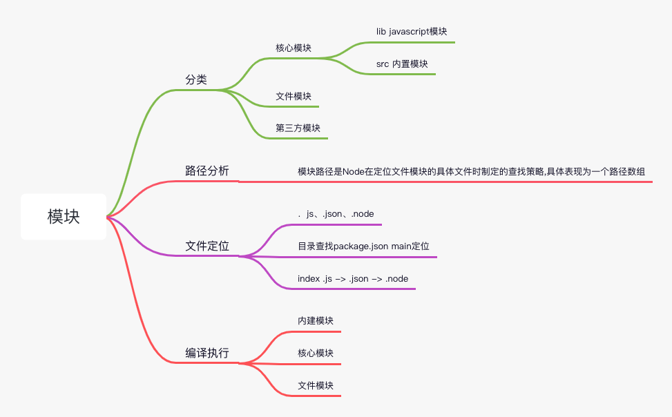

# 模块机制




## 1.1 模块分类
1. 核心模块
2. 文件模块
3. 第三方模块

## 2.1 CommonJS 出发点
JS缺陷
- 没有模块标准
- 标准库较少
- 没有标准接口
- 缺乏包管理系统

## 2.1.2 模块规范
主要分为 模块引用、模块定义、模块标识
1. 模块引用
`var math = require('math');`

2. 模块定义
- 对用require, 提供了exports 对象用于导出当前模块的方法和变量， 并且它是唯一导出的出口
- 还存在一个module对象，代表模块自身
- exports 是 module的一个属性
- 一个文件就是一个模块
```js
module.exports = {

}
exports.XXX = function() {}
```

3. 模块标识  
模块标识其实就是传递给require()方法的参数，它必须是符合小驼峰命名的字符串，或者以．、.．开头的相对路径，或者绝对路径

TODO 可对比其他模块机制

## 2.2 Node的模块实现
引用node模块，需要经历3个步骤
- 路径分析 找到对应的node_modules目录
- 文件定位 定位到具体文件 包括推测拓展名
- 编译执行 .node编译 执行 .js .json
  
node中模块按照执行步骤 分为两类：1. 核心模块 2. 文件模块 
1. 核心模块
  在node源码的编译过程中，编译成了二进制文件，
  在node启动时，部分核心模块已经被加载进了内存中，
  所以在核心模块引入时，文件定位，编译执行已经完成，并且在路径分析中是优先判断的，所以它的加载速度是最快的
   
2. 文件模块
  运行时动态加载的，需要完整的路径分析，文件定位，编译执行，所以速度比核心模块慢

加载过程
1. 优先从缓存中加载
2. 路径分析和文件定位
3. 模块标识符分析
4. 文件定位
5. 模块编译
优先从缓存中加载  
浏览器缓存文件，node缓存编译和执行后的对象
核心模块和文件模块都是缓存优先，
核心模块的缓存检查先于文件模块的缓存检查

### 2.2.1路径分析
模块标识符分析  
存在
1. 核心模块 如 http fs path 等
2. . .. 开头的相对路径文件模块
3. / 开头的绝对路径文件模块
4. 非路径形式的文件模块，如自定义的connect模块

1 是核心模块 速度最快，因为省略了编译和文件定位
2 3 是文件模块，比核心模块慢，但是因为是确定的路径了，所以省去文件定位节省的大量的时间
4 自定义模块

自定义模块指的是非核心模块，也不是路径形式的标识符。它是一种特殊的文件模块，可能是一个文件或者包的形式。这类模块的查找是最费时的，也是所有方式中最慢的一种

模块路径  
模块路径是Node在定位文件模块的具体文件时制定的查找策略,具体表现为一个路径数组
```js
[ 
  '/Users/zhanghaoqi/vuepress-FE/docs/node/node_modules',
  '/Users/zhanghaoqi/vuepress-FE/docs/node_modules',
  '/Users/zhanghaoqi/vuepress-FE/node_modules',
  '/Users/zhanghaoqi/node_modules',
  '/Users/node_modules',
  '/node_modules' 
]
```

### 2.2.2文件定位  
自定义模块的查找方式  
从缓存加载的优化策略使得二次引入时不需要路径分析、文件定位和编译执行的过程，大大提高了再次加载模块时的效率

细节： 文件扩展名、目录、包 
文件扩展名：Node会按．js、.json、.node的次序补足扩展名，依次尝试
目录分析和包：require通过分析文件拓展名后，没有找到文件，却得到的一个目录，这时会按照包来处理
1. 查找package.json main定位
2. index .js -> .json -> .node

### 2.2.3编译执行
定位到具体文件后，模块会新建一个模块对象，根据路径载入并编译
每一个编译成功的模块都会将其文件路径作为索引缓存在Module._cache对象上，以提高二次引入的性能

**文件模块**
```js
function Module(id, parent) {
  this.id = id;
  this.exports = {};
  this.parent = parent;
  if (parent && parent.children) {
    parent.children.push(this);
  } 
  this.filename = null;
  this.loaded = false;
  this.children = [];
}

module.exports = Module;

var module = new Module(filename, parent);

Module.prototype.require = function(path) {
  return Module._load(path, this);
};
```
定位到具体文件后，node新建一个模块对象，然后根据路径载入并编译。  
不同文件类型的载入方法也不同
- .js fs模块同步读取文件后编译执行
- .node c/c++ 编译的拓展文件，通过dlopen方法加载最后编译生成的文件
- .json fs读取后用JSON.parse解析
- 其它的拓展文件， 当做.js文件载入

每一个编译成功的模块都会将其文件路径作为索引缓存在Module._cache对象上，以提高二次引入的性能

js模块的编译  
require、exports、module  __filename、__dirname
```js
(function (require、exports、module  __filename、__dirname) {
  exports ...
})
```
runInThisContext()方法执行（类似eval，只是具有明确上下文，不污染全局），返回一个具体的function对象

C/C++模块的编译
JSON文件的编译


**核心模块**
核心模块缓存在NativeModule._cache上
```js
function NativeModule(id) {
  this.filename = id + '.js
  this.id = id
  this.exports = {}
  this.loaded = false
}
NativeModule._source = process.binding('natives')
NativeModule._cache = {}
```
内建模块  
内建模块的优势在于：首先，它们本身由C/C++编写，性能上优于脚本语言；其次，在进行文件编译时，它们被编译进二进制文件。一旦Node开始执行，它们被直接加载进内存中，无须再次做标识符定位、文件定位、编译等过程，直接就可执行

加载内建模块时，我们先创建一个exports空对象，然后调用get_builtin_module()方法取出内建模块对象，通过执行register_func()填充exports对象，最后将exports对象按模块名缓存，并返回给调用方完成导出。

参考
1. http://nodejs.cn/api/modules.html
2. http://www.ruanyifeng.com/blog/2015/05/require.html
3. 深入浅出node.js


